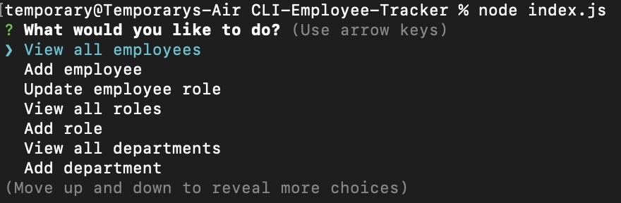

# CLI Employee Tracker

A command-line application for managing a company's employee database, using Node.js, Inquirer, and MySQL.



## Table of Contents

1. [Installation](#installation)
2. [Usage](#usage)
3. [Features](#features)
4. [License](#license)


## Installation

1. Clone the repo:
```
git clone https://github.com/yourusername/CLI-Employee-Tracker.git
```
2. Install NPM packages:
```
npm install
```
3. Setup your `.env` file to include your MySQL credentials:
```
DB_HOST=your_host
DB_USER=your_user
DB_PASSWORD=your_password
DB_DATABASE=your_database
```
## Usage

To run the application, use the following command in your terminal:
```
node index.js
```

## Features

1. **View all employees**: Displays a table with employee data, including ID, first name, last name, role, salary, department, and manager.

2. **Add employee**: Prompts the user to input a new employee's first name, last name, role, and manager, and adds the new employee to the database.

3. **Update employee role**: Allows the user to select an employee and assign a new role to them.

4. **View all roles**: Displays a table with role data, including role ID, title, department, and salary.

5. **Add role**: Prompts the user to input a new role's name, salary, and department, and adds the new role to the database.

6. **View all departments**: Displays a table with department data, including department ID and name.

7. **Add department**: Prompts the user to input a new department's name and adds the new department to the database.

8. **Quit**: Exits the application.

## License

This project is not licensed. See `LICENSE` for more information.
